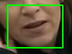
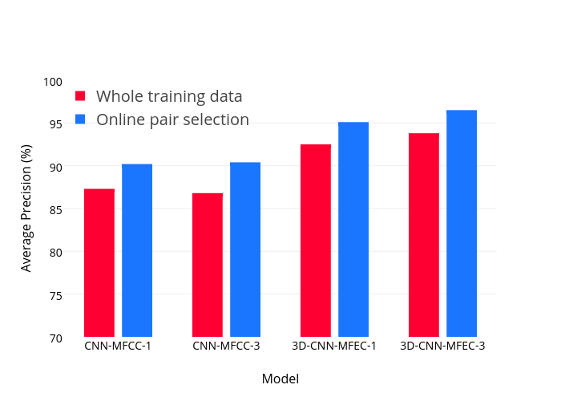

3D convolutional Neural Networks for Audio-Visual Recognition
==============================================================

  

The input pipeline must be prepared by the users. This code is aimed to provide the implementation of **Coupled 3D Convolutional Neural Networks** for audio-visual matching. **Lip-reading** can be a specific application for this work.

# DEMO

Please run the ``run.sh`` file as a demo to the project. It can be run as below:

~~~~ {.sourceCode .shell}
./run.sh
~~~~

The following command line script, only execute the lip tracking operation:

~~~~ {.sourceCode .shell}
./run.sh lip_tracking path/to/file.mp4
~~~~

Basically, the ``path/to/file.ext`` is the reletive path to the input video file. Example is ``data/sample_video.mp4``.

General View
------------

*Audio-visual recognition* (AVR) has been considered as a solution for speech recognition tasks when the audio is corrupted,  as well as a visual recognition method used for speaker verification in multi-speaker scenarios. The approach of AVR systems  is to leverage the extracted information from one modality to improve the recognition ability of the other modality by complementing the missing information.

### The Problem and the Approach

The essential problem is to find the correspondence between the audio and visual streams, which is the goal of this work. **We proposed the utilization of a coupled 3D Convolutional Neural Network (CNN) architecture that can map both modalities into a representation space to evaluate the correspondence of audio-visual streams using the learned multimodal features**.

### How to leverage 3D Convolutional Neural Networks?

The proposed architecture will incorporate both spatial and temporal information jointly to effectively find the correlation between temporal information for different modalities. By using a relatively small network architecture and much smaller dataset, our proposed method surpasses the performance of the existing similar methods for audio-visual matching which use CNNs for feature representation. We also demonstrate that effective pair selection method can significantly increase the performance.

Code Implementation
-------------------

The input pipeline must be provided by the user. The rest of the implementation consider the dataset which contains the utterance-based extracted features.

### Lip Tracking

For lip tracking, the desired video must be fed as the input. At first, cd to the corresponding directory:

~~~~ {.sourceCode .shell}
cd code/lip_tracking
~~~~

The run the dedicated `python file` as below:

~~~~ {.sourceCode .shell}
python VisualizeLip.py --input input_video_file_name.ext --output output_video_file_name.ext
~~~~

Running the aforementioned script extracts the lip motions by saving the mouth area of each frame and create the output video with a rectangular around the mouth area for better visualization.

The required `arguments` are defined by the following python script which have been defined in the `VisualizeLip.py` file:

~~~~ {.sourceCode .python}
ap = argparse.ArgumentParser()
ap.add_argument("-i", "--input", required=True,
             help="path to input video file")
ap.add_argument("-o", "--output", required=True,
             help="path to output video file")
ap.add_argument("-f", "--fps", type=int, default=30,
             help="FPS of output video")
ap.add_argument("-c", "--codec", type=str, default="MJPG",
             help="codec of output video")
args = vars(ap.parse_args())
~~~~

Some of the defined arguments have their default values and no further action is required by them.

### Processing

In the visual section, the videos are post-processed to have an equal frame rate of 30 f/s. Then, face tracking and mouth area extraction are performed on the videos using the **Dlib** library. Finally, all mouth areas are resized to have the same size and concatenated to form the input feature cube. The dataset does not contain any audio files. The audio files are extracted from videos using **FFmpeg** framework. 
The processing pipeline is the below figure.

### Input Pipeline for this work

The proposed architecture utilizes two non-identical ConvNets which uses a pair of speech and video streams. The network input is a pair of features that represent lip movement and speech features extracted from 0.3 second of a video clip. The main task is to determine if a stream of audio corresponds with a lip motion clip within the desired stream duration. In the two next sub-sections, we are going to explain the inputs for speech and visual streams.

**Speech Net**

On the time axis, the temporal features are non-overlapping 20ms windows which are used for the generation of spectrum features that possess a local characteristic. The input speech feature map, which is represented as an image cube, corresponds to the spectrogram as well as the first and second order derivatives of the MFEC features. These three channels correspond to the image depth. Collectively from a 0.3 second clip, 15 temporal feature sets (each forms 40 MFEC features) can be derived which form a speech feature cube. Each input feature map for a single audio stream has the dimensionality of 15 × 40 × 3. This representation is depicted in the following figure:

The **speech features** have been extracted using [SpeechPy](https://github.com/astorfi/speech_feature_extraction).

**Visual Net**

The frame rate of each video clip used in this effort is 30 f/s. Consequently, 9 successive image frames form the 0.3 second visual stream. The input of the visual stream of the network is a cube of size 9x60x100, where 9 is the number of frames that represent the temporal information. Each channel is a 60x100 gray-scale image of mouth region.

### Architecture

The architecture is a **coupled 3D convolutional neural network** in which *two different networks with different sets of weights must be trained*. For the visual network, the lip motions spatial information alongside the temporal information are incorporated jointly and will be fused for exploiting the temporal correlation. For the audio network, the extracted energy features are considered as a spatial dimension, and the stacked audio frames form the temporal dimension. In the proposed 3D CNN architecture, the convolutional operations are performed on successive temporal frames for both audio-visual streams.

Training / Evaluation
---------------------

At first, clone the repository. Then, cd to the dedicated directory:

~~~~ {.sourceCode .shell}
cd code/training_evaluation
~~~~

Finally, the `train.py` file must be executed:

~~~~ {.sourceCode .shell}
python train.py
~~~~

For evaluation phase, a similar script must be executed:

~~~~ {.sourceCode .shell}
python test.py
~~~~

Results
-------

The below results demonstrate effects of the proposed method on the accuracy and the speed of convergence:

The best results, which is the right-most one, belongs to our proposed method.

The effect of proposed **Online Pair Selection** method has been shown in the figure.

GitHub Source
-------------

This project is also hosted on GitHub ([link](https://github.com/astorfi/lip-reading-deeplearning)) and is actively developed.

